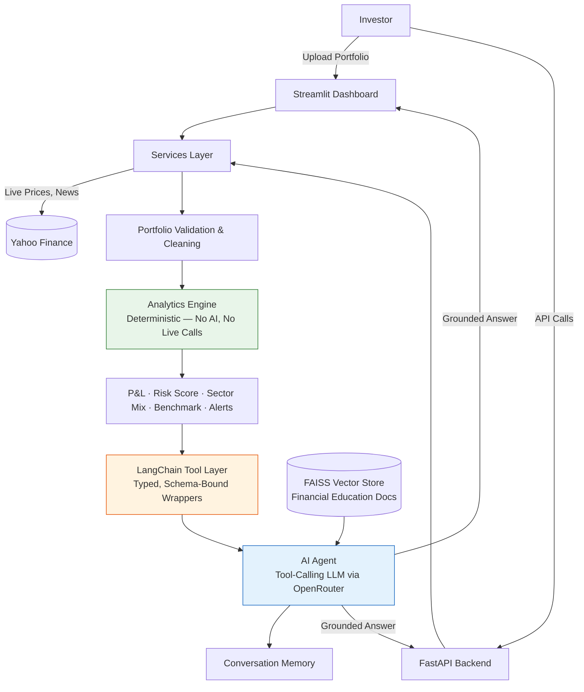

# 📊 Zerodha AI Financial Intelligence Platform

**Portfolio Analytics · Verified-Tool AI Insights · RAG-Grounded Financial Education**

An AI-powered portfolio intelligence tool that turns a spreadsheet of stock holdings into explainable, source-grounded financial insight — without ever letting a language model invent a number.

---

## 🚀 Live Deployment

### Streamlit Frontend
[Open Live Application](https://zerodha-ai-finanace-ajvtgkmevupwtdwa24ej6v.streamlit.app/)

### FastAPI Backend
[Open FastAPI Backend](https://zerodha-ai-finanace-1.onrender.com)

### FastAPI Swagger Documentation
[Open API Documentation](https://zerodha-ai-finanace-1.onrender.com/docs)

---

## Why This Exists

Retail investors don't lack data — they lack **interpretation**. A portfolio screen shows prices and percentages, but it doesn't tell you *why* your risk score moved, *whether* you're dangerously concentrated in one sector, or *what* changed in the market today that actually matters to your holdings.

This platform closes that gap. It combines a deterministic analytics engine with a tool-using AI agent so that every number the user sees — and every number the AI *talks about* — traces back to the same verified source of truth.

---

## What It Does

| Capability | Description |
|---|---|
| 📈 **Portfolio Overview** | Upload a CSV/XLSX and instantly see investment, current value, and live P&L |
| 📊 **Risk & Concentration Analytics** | A weighted 0–10 risk score built from holding concentration, sector concentration, and volatility |
| 🎯 **Benchmark Comparison** | Portfolio performance measured against the Nifty 50, live and historical |
| 🤖 **AI Portfolio Insights** | Health score, risk analysis, improvement suggestions, and plain-language summaries — all grounded in the analytics engine's own numbers |
| 💬 **Conversational AI Agent** | A tool-calling chat assistant that fetches real portfolio, market, and news data on demand rather than guessing |
| 📚 **RAG Financial Education** | A retrieval-augmented layer answers general finance questions from a curated document library, kept strictly separate from live portfolio facts |
| 📰 **Market News** | Latest stock-specific news with source and publish date |
| 🔌 **Dual Interface** | A Streamlit dashboard for interactive use, and a FastAPI backend exposing the same intelligence as a clean REST API |

---

## The Core Design Principle: Math and Reasoning Are Never the Same Layer

The single architectural decision that shapes this entire platform: **the AI never calculates anything.**

Every financial number — P&L, risk score, sector concentration, top movers — is computed once, deterministically, in the Analytics engine. The AI layer's only job is to *explain* those verified numbers in plain language. It reaches them exclusively through typed, schema-bound tools — never by reading a raw spreadsheet and guessing.

This means the platform is naturally audit-friendly: any number the AI says can be traced back to a pure function with no external dependencies, no randomness, and no hallucination risk.

---

## Architecture



### Layer Breakdown

| Layer | Responsibility | Key Files |
|---|---|---|
| **Services** | Reads uploaded portfolios, fetches live prices and news from Yahoo Finance | `services/portfolio.py`, `services/market.py`, `services/news.py` |
| **Analytics Engine** | Pure, deterministic math — P&L, risk scoring, sector breakdown, benchmark comparison | `Analytics/portfolio_analytics.py`, `Analytics/risk_alerts.py`, `Analytics/sector_analysis.py`, `Analytics/benchmark_comparison.py` |
| **Tool Layer** | Wraps Analytics functions as typed LangChain tools the AI agent can call on demand | `AI/tools/*.py` |
| **AI Agent** | Tool-calling conversational assistant with memory, grounded strictly in tool output | `AI/chat_chain.py`, `AI/client.py`, `AI/memory.py` |
| **RAG Layer** | Retrieval-augmented answers for general financial education, kept separate from live portfolio data | `rag/ingest.py`, `rag/retriever.py`, `rag/rag_chain.py` |
| **Interfaces** | Streamlit dashboard for interactive use; FastAPI for programmatic access | `dashboard/dashboard.py`, `fastapi_app.py` |

---

## Tech Stack

- **Frontend:** Streamlit, Plotly
- **Backend API:** FastAPI
- **AI Orchestration:** LangChain, tool-calling agent pattern
- **LLM Access:** OpenRouter (provider-agnostic)
- **Retrieval:** FAISS + HuggingFace sentence embeddings
- **Data:** pandas, yfinance
- **Language:** Python

---

## Getting Started

```bash
# Install dependencies
pip install -r requirements.txt

# Configure your API key
cp .env.example .env
# add your OPENROUTER_API_KEY

# (Optional) Build the RAG knowledge base
python -m rag.ingest

# Run the interactive dashboard
streamlit run app.py

# Or run the API server
uvicorn fastapi_app:app --reload
```

---

## Roadmap: Where This Platform Is Headed

This release proves the core architecture — grounded analytics, verified tool-calling, and safe AI explanation — end to end. The next phase is about scale and trust depth:

- **Persistent audit trail** — every AI interaction, tool call, and generated insight logged for compliance review and historical traceability
- **Structured, schema-validated AI output** — confidence scores, disclaimer flags, and source citations attached to every recommendation card, not just prose
- **Multi-user accounts & saved portfolios** — moving from single-session analysis to a durable, personalized investor workspace
- **Governed MCP-style tool server** — formalizing the current tool layer into a standalone, independently deployable service for broader integration
- **Expanded risk modeling** — historical backtesting of the risk-scoring thresholds against real market drawdowns

Each of these builds directly on top of the existing analytics-first foundation — nothing here requires re-architecting what's already working.

---

## Disclaimer

This platform is built for educational and informational purposes. It does not constitute financial advice, and it does not guarantee investment returns. Always consult a licensed financial advisor before making investment decisions.
